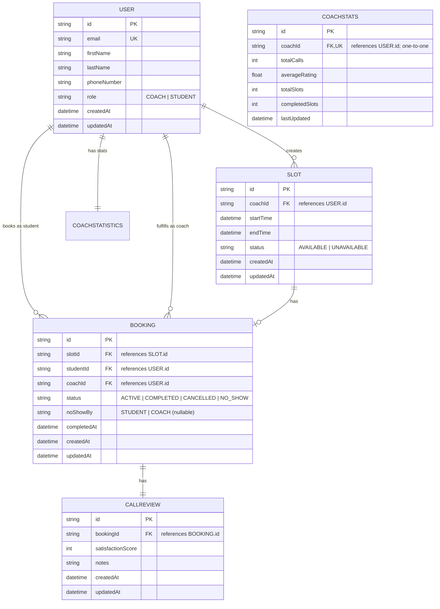
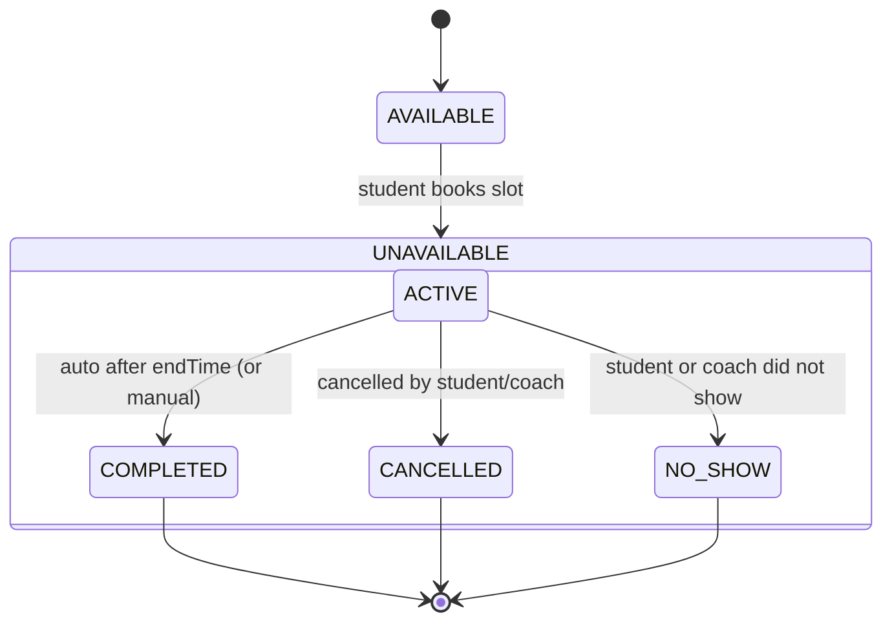
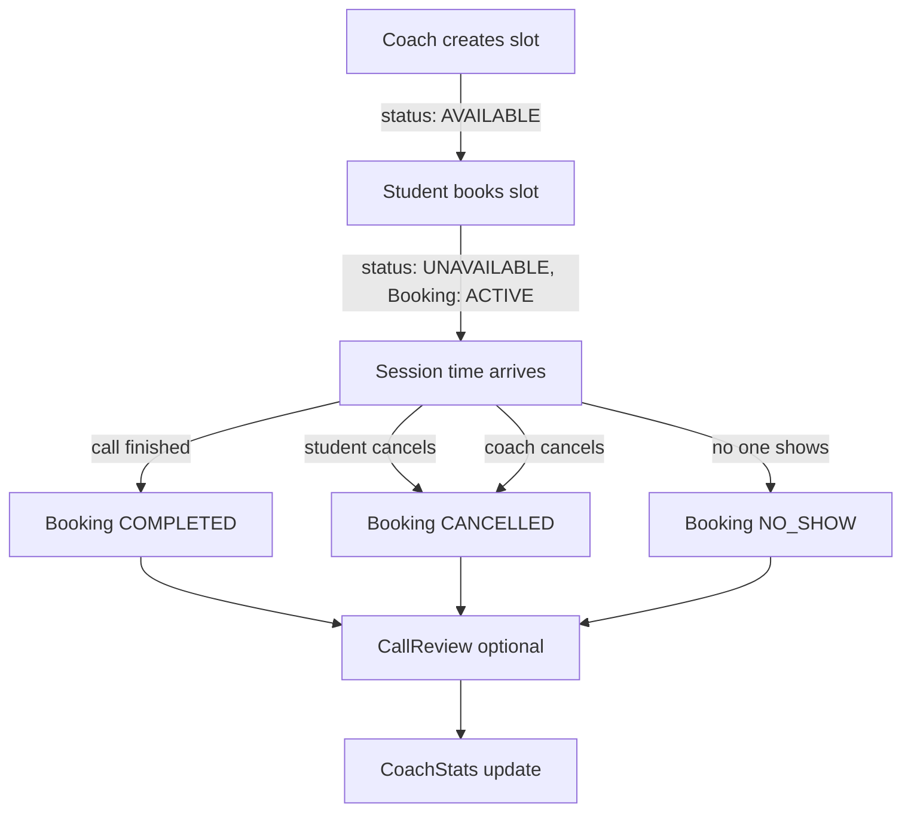

# Coaching Platform – Database Design

This document describes the **database entities, relationships, and lifecycle flows** for the coaching scheduling platform.  
It uses **Prisma** with **PostgreSQL** and is designed for **production-quality systems**.

---

## 📦 Entities

### User

- Represents both coaches and students.
- Differentiated by `role` (`COACH` or `STUDENT`).
- Coaches create slots; students book them.

### Slot

- A block of time created by a coach.
- Status:
    - `AVAILABLE`: slot can be booked.
    - `UNAVAILABLE`: slot has been booked.
- Only deletable if `AVAILABLE`.

### Booking

- Created when a student reserves a slot.
- Exactly one booking per slot (`slotId` is unique).
- Lifecycle statuses:
    - `ACTIVE`: reserved but not finished.
    - `COMPLETED`: session happened.
    - `CANCELLED`: session cancelled before completion.
    - `NO_SHOW`: session missed by student or coach.
- Tracks:
    - `noShowBy`: who did not show (`STUDENT` or `COACH`).
    - `completedAt`: when it was marked completed.

### CallReview

- Optional feedback linked 1:1 with a booking.
- Includes satisfaction score (1–5) and optional notes.

### CoachStats

- One-to-one with each coach.
- Tracks total calls, average rating, total slots, and completed slots.
- Updated when bookings complete.

---

## 🗄️ Entity–Relationship Diagram (ERD)

> Mermaid ERD notes: use lowercase types (`string`, `int`, `float`, `datetime`).  
> Keys can be marked `PK`, `FK`, `UK`. Use **comments** (quoted strings) to hint references.

## Slot & Booking Lifecycle

## Process Flow

